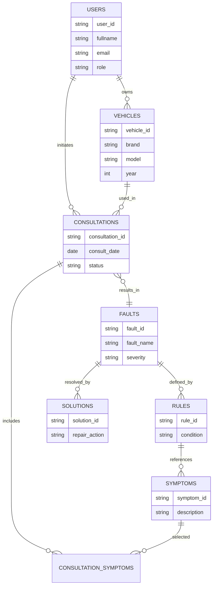
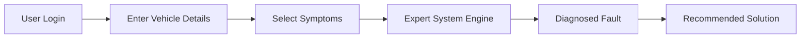
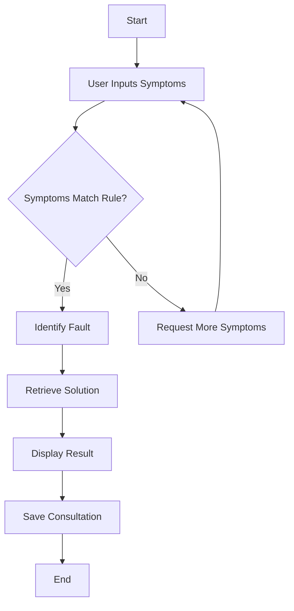

## 4.4 DATABASE STRUCTURE

The online expert system for car maintenance and troubleshooting adopts a structured database design to support knowledge storage, user interaction, fault diagnosis, and solution recommendation. The database is designed to efficiently manage vehicle data, symptoms, rules, diagnoses, and user consultation history.

The system uses a relational-logical model conceptually (even if implemented with SQL or NoSQL), emphasizing clear entity relationships to support inference and troubleshooting accuracy.

### Main Database Entities

* Users
* Vehicles
* Symptoms
* Faults
* Diagnostic Rules
* Solutions
* Consultation History

### Entity Relationship Diagram (ERD)

---

## 4.5 DATABASE DEFINITION TABLE

### Table 4.1: Users Table

| Field Name | Data Type | Description            | Constraint  |
| ---------- | --------- | ---------------------- | ----------- |
| user_id    | VARCHAR   | Unique user identifier | Primary Key |
| fullname   | VARCHAR   | User full name         | Required    |
| email      | VARCHAR   | User email address     | Unique      |
| password   | VARCHAR   | Encrypted password     | Required    |
| role       | VARCHAR   | User role (Admin/User) | Required    |

---

### Table 4.2: Vehicles Table

| Field Name  | Data Type | Description          | Constraint  |
| ----------- | --------- | -------------------- | ----------- |
| vehicle_id  | VARCHAR   | Vehicle identifier   | Primary Key |
| user_id     | VARCHAR   | Vehicle owner        | Foreign Key |
| brand       | VARCHAR   | Vehicle manufacturer | Required    |
| model       | VARCHAR   | Vehicle model        | Required    |
| year        | INT       | Year of manufacture  | Required    |
| engine_type | VARCHAR   | Engine specification | Optional    |

---

### Table 4.3: Symptoms Table

| Field Name  | Data Type | Description         | Constraint  |
| ----------- | --------- | ------------------- | ----------- |
| symptom_id  | VARCHAR   | Symptom identifier  | Primary Key |
| description | TEXT      | Symptom description | Required    |

---

### Table 4.4: Faults Table

| Field Name | Data Type | Description          | Constraint  |
| ---------- | --------- | -------------------- | ----------- |
| fault_id   | VARCHAR   | Fault identifier     | Primary Key |
| fault_name | VARCHAR   | Name of fault        | Required    |
| severity   | VARCHAR   | Fault severity level | Required    |

---

### Table 4.5: Solutions Table

| Field Name     | Data Type | Description         | Constraint  |
| -------------- | --------- | ------------------- | ----------- |
| solution_id    | VARCHAR   | Solution identifier | Primary Key |
| fault_id       | VARCHAR   | Related fault       | Foreign Key |
| repair_action  | TEXT      | Recommended repair  | Required    |
| estimated_cost | DECIMAL   | Cost estimate       | Optional    |

---

### Table 4.6: Consultation History Table

| Field Name      | Data Type | Description          | Constraint  |
| --------------- | --------- | -------------------- | ----------- |
| consultation_id | VARCHAR   | Consultation ID      | Primary Key |
| user_id         | VARCHAR   | Consulting user      | Foreign Key |
| vehicle_id      | VARCHAR   | Vehicle used         | Foreign Key |
| fault_id        | VARCHAR   | Diagnosed fault      | Foreign Key |
| consult_date    | DATE      | Date of consultation | Required    |

---

## 4.6 INPUT AND OUTPUT SCREEN

The system provides intuitive interfaces to collect user input and display diagnostic results.

### 4.6.1 Input Screens

* User Login / Registration Screen
* Vehicle Information Input Screen
* Symptom Selection Screen (checkbox-based)

### 4.6.2 Output Screens

* Diagnosis Result Screen
* Fault Description and Severity Screen
* Recommended Solution and Maintenance Tips Screen

### Input–Output Flow Diagram

---

## 4.7 PROGRAM ALGORITHM

The expert system operates using a **rule-based inference mechanism**, where user-selected symptoms are matched against stored diagnostic rules to infer possible faults and solutions.

### 4.7.1 Fault Diagnosis Algorithm (Pseudocode)

**Algorithm: Car Maintenance Diagnosis**

1. Start
2. User logs into the system
3. User enters vehicle details
4. User selects observed symptoms
5. System retrieves relevant diagnostic rules
6. IF symptom pattern matches a rule

   * Identify associated fault
   * Retrieve corresponding solution
7. Display fault diagnosis and solution
8. Store consultation record
9. End

---

### Diagnostic Decision Flowchart

